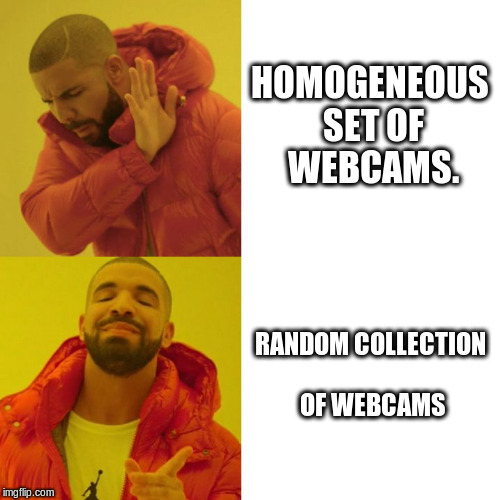

# Webcams

A random collection of IP webcams purchased from Amazon and [Aliexpress](https://www.aliexpress.com/)

**Pros:**

- The Chinese government won't see my entire house.
- Worst offenders can be vlan quarantined or put in generic places.
- Not everyone will be on the Mirai botnet.
- Endless amount of reverse engineering projects!

**Cons:**

- Endless amount of reverse engineering projects!

## Lessons Learned.

- Make sure a reset button is available. Even if it's on the PCB. Thankfully Hikvision has enough security holes to allow for a reset.

## Misc

Find RTSP webcams on the lan:

    nmap -oG - -p 554 10.0.0.0/22 | grep open
